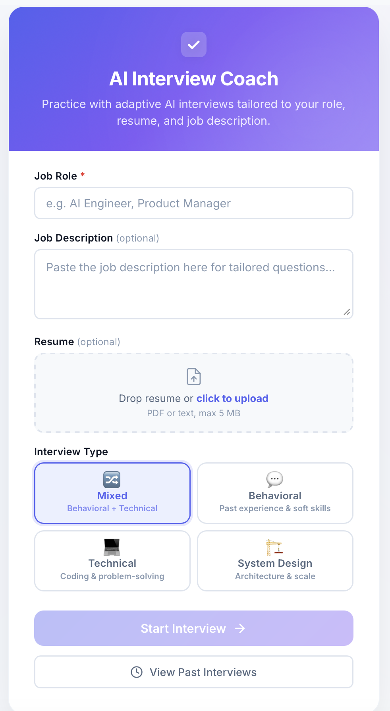

# AI Interview Coach

**A multi-agent AI system that conducts realistic mock interviews, provides real-time feedback, and generates structured scorecards — built with LangGraph, FastAPI, and LiteLLM.**

[](https://python.org)
[](https://fastapi.tiangolo.com)
[](https://langchain-ai.github.io/langgraph/)
[](https://docs.litellm.ai)
[](https://docker.com)
[](https://github.com/features/actions)

---

## Why This Project

Most AI interview tools generate a static list of questions. This project takes a fundamentally different approach: it implements a **multi-agent agentic workflow** where specialized AI agents collaborate in real-time — one conducts the interview, another evaluates responses, and a third synthesizes everything into an actionable scorecard. The agents communicate through a **graph-based state machine** with human-in-the-loop interaction, adaptive difficulty scaling, and persistent session management.

---

## Demo

<p align="center">
  
</p>

---

## Agentic Architecture

This is not a simple prompt-response chatbot. It is a **stateful, multi-agent system** orchestrated by LangGraph with four autonomous nodes that collaborate through shared state:

```
                    ┌─────────────────────────────────────────────┐
                    │           LangGraph State Machine            │
                    │                                             │
 Browser ──────────►│  ┌──────────────┐    ┌──────────────────┐   │
 (WebSocket)        │  │  Interviewer  │───►│    Candidate     │   │
                    │  │    Agent      │    │  (Human Input)   │   │
                    │  └──────▲───────┘    └────────┬─────────┘   │
                    │         │                     │              │
                    │         │              ┌──────▼─────────┐   │
                    │         │              │   Conditional   │   │
                    │         │              │    Router       │   │
                    │         │              └───┬────────┬────┘   │
                    │         │                  │        │        │
                    │  ┌──────┴───────┐    ┌────▼────┐   │        │
                    │  │  Evaluator   │◄───┤Continue? │   │        │
                    │  │    Agent     │    └─────────┘   │        │
                    │  └──────────────┘           ┌──────▼─────┐  │
                    │                             │  Summary   │  │
                    │                             │   Agent    │  │
                    │                             └──────┬─────┘  │
                    └─────────────────────────────────────┼────────┘
                                                         │
                                                    Scorecard
```

### Agent Responsibilities

| Agent | Role | Key Behaviors |
|-------|------|---------------|
| **Interviewer** | Conducts the interview | Adapts question difficulty based on candidate performance; tailors questions to job description and resume; progresses through warm-up → foundation → advanced → expert tiers |
| **Candidate** | Human-in-the-loop checkpoint | Uses LangGraph's `interrupt()` to pause graph execution, collect user input via WebSocket, and resume the workflow |
| **Evaluator** | Provides real-time feedback | Scores each answer (1-10), identifies strengths and gaps, suggests stronger responses; output is post-processed to ensure clean feedback |
| **Summary** | Generates final scorecard | Analyzes the full conversation, produces structured JSON with category scores, strengths, improvement areas, and overall assessment |

### What Makes This Agentic (Not Just a Chatbot)

- **Autonomous decision-making**: The Interviewer agent independently selects question topics, difficulty levels, and follow-up strategies based on candidate performance — not a scripted question list
- **Inter-agent communication**: The Evaluator's scores directly influence the Interviewer's next question difficulty through shared graph state
- **Adaptive difficulty (GRE-style algorithm)**: Performance tracking across 5 difficulty tiers with automatic tier adjustment based on score streaks
- **Conditional routing**: The graph dynamically routes between continuing the interview, ending early, or generating a summary based on state conditions
- **Human-in-the-loop**: LangGraph's `interrupt()` mechanism pauses agent execution to collect human input, then seamlessly resumes the agentic workflow
- **Stateful checkpointing**: Full conversation state is checkpointed at every node transition, enabling resumable sessions

---

## Adaptive Difficulty System

The interview dynamically adjusts question difficulty using a GRE-inspired algorithm:

```
Tier 0: Warm-up       ──► Straightforward, rapport-building questions
Tier 1: Foundation    ──► Core concepts, moderate depth
Tier 2: Mid-level     ──► Role-specific, structured thinking required
Tier 3: Advanced      ──► Multi-step analysis, trade-off discussions
Tier 4: Expert        ──► Complex scenarios, edge cases, system-level thinking
```

**Tier transitions:**
- Score >= 7 on 2+ consecutive answers → Tier UP
- Score <= 4 on 2+ consecutive answers → Tier DOWN
- Performance trend (improving/declining/stable) is tracked and communicated to the Interviewer agent

---

## Features

### Interview Modes
- **Behavioral** — Past experience, teamwork, leadership, conflict resolution
- **Technical** — Debugging, optimization, API design, concurrency, security
- **System Design** — Scalability, consistency, caching, microservices, cost trade-offs
- **Mixed** — Balanced rotation across all categories

### Resume-Aware Interviews
Upload a resume (PDF or text) and the system:
- Tailors questions to the candidate's stated experience
- Probes gaps between resume claims and demonstrated knowledge
- Includes resume-vs-performance analysis in the final scorecard

### Real-Time Evaluation
After each answer, the Evaluator agent provides:
- A score (1-10) with category breakdown
- Specific strengths identified in the response
- Targeted improvement suggestions
- A "stronger answer" example the candidate can study

### Structured Scorecard
The final scorecard includes:
- Category scores (Technical, Problem Solving, Communication, Culture Fit)
- Overall grade with visual ring indicator
- Top strengths and areas for improvement
- Comprehensive performance summary
- Copy-to-clipboard export

### Interview History
- All interviews are persisted to SQLite
- Browse past interviews with scores and timestamps
- Review full conversation transcripts and scorecards
- Track improvement over time

---

## Tech Stack

| Layer | Technology | Why This Choice |
|-------|-----------|-----------------|
| **Agent Orchestration** | LangGraph | Graph-based state machine with built-in checkpointing, conditional edges, and `interrupt()` for human-in-the-loop — purpose-built for agentic workflows |
| **Backend** | FastAPI | Async-native HTTP + WebSocket server with automatic OpenAPI docs |
| **LLM Gateway** | LiteLLM | Unified API across 100+ LLM providers — swap between OpenAI, Anthropic, Ollama with a config change |
| **Real-Time Transport** | WebSocket + JSON | Bidirectional structured messaging for streaming agent updates without polling |
| **Persistence** | SQLite (aiosqlite) | Zero-config async database for interview history — no external services needed |
| **Frontend** | Alpine.js | Lightweight reactivity with no build step — keeps deployment simple |
| **Resume Parsing** | pypdf | Extract text from uploaded PDF resumes |
| **Config** | Pydantic Settings | Typed, validated configuration from `.env` with fail-fast on missing API keys |
| **Containerization** | Docker (multi-stage) | Reproducible builds with non-root user and health checks |
| **CI/CD** | GitHub Actions | Automated linting (ruff), testing (pytest), and Docker builds on every push |

---

## Project Structure

```
app/
├── main.py            # FastAPI app, WebSocket handler, REST API endpoints
├── config.py          # Pydantic settings with validation (fail-fast on bad config)
├── models.py          # GraphState (TypedDict), Pydantic request/response models
├── graph.py           # LangGraph state machine — nodes, edges, conditional routing
├── agents.py          # Agent node functions, system prompts, adaptive difficulty logic
├── llm_service.py     # LiteLLM wrapper with retry logic, provider-specific handling
├── database.py        # SQLite persistence (aiosqlite) — interviews + messages tables
└── resume_parser.py   # PDF/text resume extraction

static/
├── app.js             # Alpine.js application — 4 screens (setup, chat, summary, history)
└── style.css          # Design system with CSS custom properties, responsive layout

templates/
└── index.html         # Single-page app with Alpine.js directives, SVG components

tests/
├── conftest.py        # Pytest fixtures — sample states, mock LLM responses
├── test_agents.py     # Agent node tests — message building, scoring, evaluator cleaning
├── test_api.py        # HTTP + WebSocket endpoint tests
├── test_graph.py      # State machine routing logic tests
└── test_config.py     # Configuration validation tests

.github/workflows/
└── ci.yml             # CI pipeline — lint, test, Docker build

Dockerfile             # Multi-stage build (3.11-slim, non-root, health check)
docker-compose.yml     # Single-command deployment with env_file support
```

---

## Getting Started

### Prerequisites

- Python 3.11+
- An API key from OpenAI, Anthropic, or any [LiteLLM-supported provider](https://docs.litellm.ai/docs/providers)

### Installation

```bash
# Clone the repository
git clone https://github.com/<your-username>/Automated-Candidate-Interview-Evaluation-System.git
cd Automated-Candidate-Interview-Evaluation-System

# Create and activate virtual environment
python -m venv venv
source venv/bin/activate  # On Windows: venv\Scripts\activate

# Install dependencies
pip install -r requirements.txt
```

### Configuration

```bash
cp .env.example .env
```

Edit `.env`:

```env
# LiteLLM model string (see https://docs.litellm.ai/docs/providers)
LLM_MODEL=anthropic/claude-sonnet-4-20250514

# Your API key
LLM_API_KEY=your-api-key-here

# Interview settings (optional)
NUM_QUESTIONS=5
MAX_EVALUATOR_WORDS=50
```

**Supported providers:**

| Provider | Model String | Notes |
|----------|-------------|-------|
| Anthropic | `anthropic/claude-sonnet-4-20250514` | Recommended |
| OpenAI | `openai/gpt-4o` | Full JSON mode support |
| Ollama (local) | `ollama/llama3` | No API key needed |

### Run Locally

```bash
uvicorn app.main:app --reload
```

Open [http://localhost:8000](http://localhost:8000)

### Run with Docker

```bash
docker-compose up --build
```

### Share via ngrok

```bash
brew install ngrok          # macOS
ngrok http 8000             # Generates a public URL
```

---

## WebSocket Message Protocol

All client-server communication uses structured JSON over WebSocket:

```jsonc
// Client → Server: Start interview
{"job_position": "AI Engineer", "job_description": "...", "interview_type": "technical", "resume_text": "..."}

// Client → Server: Submit answer
{"type": "user_input", "content": "My answer..."}

// Client → Server: End early
{"type": "end_interview"}

// Server → Client: Agent message (interviewer or evaluator)
{"type": "agent_message", "source": "interviewer", "content": "...", "metadata": {"difficulty_tier": 2}}

// Server → Client: System events
{"type": "system_event", "event": "waiting_for_input", "metadata": {"questions_asked": 3, "num_questions": 5}}
{"type": "system_event", "event": "agent_typing"}

// Server → Client: Final scorecard
{"type": "summary", "content": "...", "metadata": {"scores": {...}, "strengths": [...], "improvements": [...]}}
```

---

## REST API

| Method | Endpoint | Description |
|--------|----------|-------------|
| `GET` | `/` | Serves the interview UI |
| `GET` | `/health` | Health check (`{"status": "ok", "model": "..."}`) |
| `POST` | `/api/upload-resume` | Upload PDF/text resume (max 5 MB) |
| `GET` | `/api/interviews` | List past interviews (paginated) |
| `GET` | `/api/interviews/{id}` | Full interview detail with messages |
| `WS` | `/ws/interview` | WebSocket interview session |

---

## Testing

```bash
# Run all tests
pytest

# Run with coverage
pytest --cov=app

# Run specific test module
pytest tests/test_agents.py -v
```

Test suite covers:
- Agent node functions (message construction, scoring, adaptive difficulty)
- Evaluator output post-processing
- State machine routing logic
- HTTP and WebSocket endpoints
- Configuration validation

---

## Design Decisions

| Decision | Rationale |
|----------|-----------|
| **LangGraph over raw LangChain** | Graph-based orchestration provides explicit state management, conditional routing, and built-in checkpointing — essential for a multi-turn, multi-agent workflow with human interaction |
| **`interrupt()` for human input** | LangGraph's interrupt mechanism cleanly pauses graph execution at the candidate node, collects input via WebSocket, and resumes — no polling, no state hacks |
| **LiteLLM instead of direct API calls** | Abstracts provider differences (Anthropic content blocks vs. OpenAI message format), handles retries, and enables switching LLM providers with a single config change |
| **Post-processing evaluator output** | LLMs occasionally generate questions in evaluation output despite prompt instructions. A programmatic cleaning step (`_clean_evaluator_response`) provides a reliable safety net beyond prompt engineering |
| **Random question angle injection** | With identical inputs, LLMs produce identical outputs at the same temperature. Injecting a randomly selected angle from a pool of 10+ per interview type ensures variety across sessions |
| **SQLite for persistence** | Zero-dependency async database (aiosqlite) that works out of the box — appropriate for a single-server deployment without external infrastructure |
| **Alpine.js (no build step)** | Keeps the frontend deployment simple — no Node.js, no bundler, no build pipeline. Single HTML file with reactive data binding |

---

## License

This project is licensed under the MIT License — see the [LICENSE](LICENSE) file for details.
